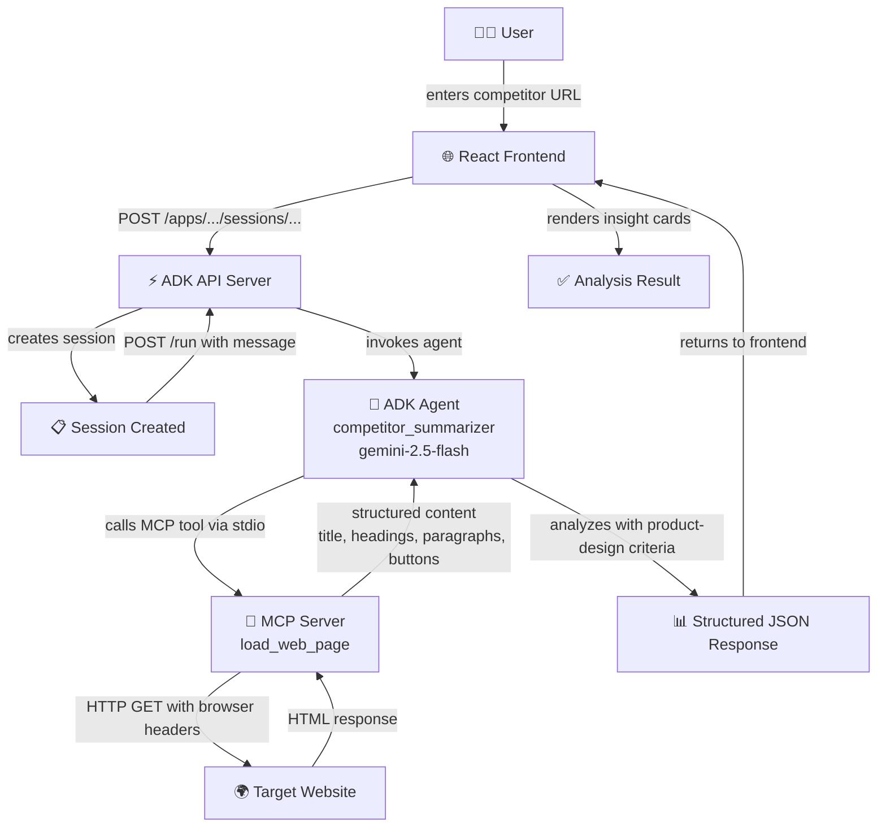

# Competitor Landing Page Summarizer

---

## Participant Details

**Participant Name:**
Fadly Uzzaki

**Project Title:**
Competitor Landing Page Summarizer

**Project Tagline:**
Turn competitor pages into structured product-design insights

---

## Problem Statement

Product designers frequently analyze competitor landing pages to understand positioning, value proposition, target audience, call-to-action strategy, trust signals, information hierarchy, and UX writing patterns. However, this workflow remains highly manual, repetitive, inconsistent, and difficult to document in a reusable format.

In practice, designers often open several competitor websites, scan each page manually, take fragmented notes, and then spend additional time converting those observations into structured benchmarking documents. This slows down early-stage discovery, reduces comparability between products, and creates unnecessary cognitive load.

The problem is not the lack of available information. The problem is the lack of a simple system that can transform public landing pages into structured, design-relevant insight that is immediately useful for benchmarking and product analysis.

---

## Brief about the Idea

Competitor Landing Page Summarizer is a web application that helps product designers transform competitor landing pages into structured product-design insights.

A user simply pastes a public landing page URL into the webapp. The system retrieves the page content, analyzes it through an ADK-powered agent, and returns a structured summary that includes:

- **Product / Brand**
- **Core Value Proposition**
- **Likely Target Audience**
- **Main Calls to Action**
- **Information Hierarchy**
- **Trust Signals**
- **UX Writing Observations**
- **Potential Friction Points**
- **Design Opportunities**
- **Product Designer Summary**

The purpose of the solution is to reduce repetitive benchmarking work and enable designers to focus more on interpretation and decision-making rather than manual extraction.

---

## Meeting the Build Criteria

This solution is intentionally designed to meet the build requirement through the meaningful use of **ADK + MCP** as core architectural components.

The implementation follows this pattern:

```
Webapp UI → ADK API Server → ADK Agent → MCP Server Tool (load_web_page) → Structured analysis JSON
```

### How the build criteria are met:

**ADK is used as the reasoning layer**
The backend runs through the official ADK runtime (`adk api_server`) and hosts a dedicated `LlmAgent` named `competitor_summarizer` responsible for product-design analysis. The agent uses `gemini-2.5-flash` via Vertex AI and is configured with a detailed system instruction that enforces structured JSON output following a product-design schema.

**MCP is used as the tool integration layer**
A custom MCP server (`backend/mcp_server/server.py`) exposes a webpage-loading tool called `load_web_page`, enabling the ADK agent to retrieve and analyze public webpage content through standardized MCP communication via stdio transport.

**The solution reflects the MCP integration pattern from the learning material**
The build uses the same core concept demonstrated in the MCP tutorial: ADK acts as an MCP client through `McpToolset` with `StdioConnectionParams`, discovering and invoking tools exposed by an MCP server built with `FastMCP`.

**The final product is a usable custom solution**
This is not only a technical exercise. It is implemented as a webapp-first product prototype designed for a real workflow in product design research. The frontend (`frontend/src/App.tsx`) communicates with the ADK API Server through standard ADK endpoints (`/apps/.../sessions/...` for session creation and `/run` for agent invocation).

This makes the project aligned with the requirement to build a custom solution using ADK and MCP in a meaningful and visible way.

---

## Opportunities

This solution differs from generic webpage summarizers because it is specifically designed for **product-design benchmarking**.

### How it differs from existing solutions

Most existing tools either:
- summarize webpage content in a generic way,
- focus on SEO or marketing analysis,
- or require significant manual interpretation afterward.

This project is different because it is explicitly optimized for a **product designer's perspective**, not for generic content summarization. The agent's system instruction enforces analysis through UX-specific lenses: value proposition clarity, CTA strategy, trust signal identification, information hierarchy, friction point detection, and design opportunity surfacing.

### How it solves the problem

It converts a repetitive and unstructured workflow into a structured one. Instead of manually extracting insights from each landing page, designers receive a reusable and comparable output format in one flow. The MCP tool (`load_web_page`) handles the content extraction using BeautifulSoup and lxml, removing noisy elements (scripts, styles, SVGs, iframes) and returning clean structured text. The ADK agent then analyzes this content against product-design criteria and returns a consistent JSON schema.

### Unique value proposition

- Specifically tailored for product-design analysis
- Structured output for benchmarking (consistent JSON schema across all analyses)
- Webapp-first and easy to demonstrate
- Powered by real MCP + ADK architecture
- Extensible into broader design research workflows

---

## List of Features Offered by the Solution

1. **Paste a competitor landing page URL** — Single URL input with monospace styling and link icon
2. **Analyze public webpage content through MCP tool invocation** — The `load_web_page` MCP tool fetches pages with browser-like headers and extracts structured content (title, headings, paragraphs, buttons)
3. **Generate structured product-design summaries** — 10-field JSON output covering all key product-design dimensions
4. **Extract likely target audience and value proposition** — Dedicated analysis fields for audience and core promise
5. **Identify call-to-action strategy and trust signals** — Array-based fields capturing 2–5 items each
6. **Highlight UX writing observations** — Tone, clarity, and microcopy analysis
7. **Surface friction points and design opportunities** — Actionable insights for product improvement
8. **Render results in a clean web interface** — Animated card-based layout with motion transitions and tag-based section headers
9. **Copy output as JSON or Markdown** — One-click copy buttons with visual feedback (checkmark animation)
10. **Example URLs for quick demo** — Pre-loaded examples (linear.app, stripe.com, vercel.com) for instant testing

---

## Process Flow Diagram / Use-Case Diagram

### Process Flow



### Use Case

**Primary actor:** Product Designer

**Primary use case:**
Analyze a competitor landing page and receive a structured benchmark summary for discovery, critique, and product research.

**Secondary use cases:**

- Reuse the output in design documentation
- Compare competitor messaging across products
- Support UX writing review and tone analysis
- Prepare material for team discussion and design critique

---

## Technologies Used in the Solution

### Frontend
| Technology | Version | Purpose |
|---|---|---|
| Vite | ^6.2.0 | Build tool and dev server |
| React | ^19.0.0 | UI component framework |
| TypeScript | ~5.8.2 | Type-safe development |
| Tailwind CSS | ^4.1.14 | Utility-first styling |
| Motion | ^12.23.24 | Animation and transitions |
| Lucide React | ^0.546.0 | Icon system |

### Backend
| Technology | Version | Purpose |
|---|---|---|
| Google ADK | ≥1.0.0 | Agent framework and API server |
| MCP | ≥1.0.0 | Model Context Protocol for tool integration |
| Python | 3.11 | Runtime language |
| BeautifulSoup4 | ≥4.12.0 | HTML parsing and content extraction |
| Requests | ≥2.31.0 | HTTP client for webpage fetching |
| lxml | ≥5.0.0 | Fast HTML/XML parser backend |

### Runtime / Deployment
| Technology | Purpose |
|---|---|
| ADK API Server | Hosts the agent as a FastAPI service |
| Google Cloud Run | Serverless container deployment |
| Vertex AI / Gemini 2.5 Flash | LLM model for analysis |
| Docker | Containerization for both frontend and backend |
| Google Cloud Build | CI/CD build pipeline |

### Architecture

```
┌─────────────────────────────────────────────────────────────────────┐
│                        Google Cloud Run                             │
│                                                                     │
│  ┌──────────────────────┐        ┌────────────────────────────────┐ │
│  │   Frontend Service   │        │      Backend Service           │ │
│  │                      │  HTTPS │                                │ │
│  │  React + Vite        │───────▶│  ADK API Server (FastAPI)      │ │
│  │  TypeScript          │        │       │                        │ │
│  │  Tailwind CSS        │        │       ▼                        │ │
│  │  Motion animations   │        │  ┌─────────────────────┐      │ │
│  │                      │        │  │   ADK Agent          │      │ │
│  │  Port: 4173          │        │  │   competitor_        │      │ │
│  │                      │        │  │   summarizer         │      │ │
│  └──────────────────────┘        │  │   (gemini-2.5-flash) │      │ │
│                                  │  └─────────┬───────────┘      │ │
│                                  │            │ stdio             │ │
│                                  │            ▼                   │ │
│                                  │  ┌─────────────────────┐      │ │
│                                  │  │   MCP Server         │      │ │
│                                  │  │   (FastMCP)          │      │ │
│                                  │  │                      │      │ │
│                                  │  │   Tool:               │      │ │
│                                  │  │   load_web_page       │      │ │
│                                  │  └─────────┬───────────┘      │ │
│                                  │            │ HTTP GET          │ │
│                                  │            ▼                   │ │
│                                  │     Target Website             │ │
│                                  │                                │ │
│                                  │  Port: 8080                    │ │
│                                  └────────────────────────────────┘ │
└─────────────────────────────────────────────────────────────────────┘
```

### Output Schema

```json
{
  "url": "https://example.com",
  "product_brand": "Brand Name",
  "core_value_proposition": "What the product promises",
  "target_audience": "Who the product is designed for",
  "cta_strategy": ["Primary CTA", "Secondary CTA"],
  "information_hierarchy": "How content is structured",
  "trust_signals": ["Signal 1", "Signal 2"],
  "ux_writing_notes": "Observations about tone and microcopy",
  "friction_points": ["Friction 1", "Friction 2"],
  "design_opportunities": ["Opportunity 1", "Opportunity 2"],
  "designer_summary": "Concise opinionated summary"
}
```

---

## Snapshots of the Prototype

### 1. Home / Input Screen

> **What it shows:**
> - Application title: "COMPETITOR LANDING PAGE SUMMARIZER"
> - Badge: "ADK_AGENT · MCP_TOOL"
> - Subtitle: "Paste a competitor's URL to extract structured UX and product design insights. Powered by a Gemini ADK agent with a custom MCP web loader."
> - URL input field with link icon and placeholder `https://example.com`
> - "Analyze Page →" button (primary blue)
> - Example URL chips: `linear.app`, `stripe.com`, `vercel.com`
> - Top bar showing: "SYSTEM ONLINE | DESIGN_RESEARCH_v2.0" with status dot

`[Screenshot: Home Screen — paste screenshot here]`

---

### 2. Loading State

> **What it shows:**
> - Animated scanning card with "[ SCANNING ]" label
> - Spinning loader icon (blue accent)
> - "ADK agent analyzing page..." status text
> - "This usually takes 10–20 seconds" helper text
> - "Analyzing..." button state with spinner

`[Screenshot: Loading State — paste screenshot here]`

---

### 3. Result Screen

> **What it shows:**
> - "[ANALYSIS_COMPLETE]" label
> - Product / Brand name as heading
> - Analyzed URL as clickable link
> - Card grid with tagged sections:
>   - `[VALUE_PROP]` Core Value Proposition
>   - `[AUDIENCE]` Likely Target Audience
>   - `[CTA]` Main Calls to Action
>   - `[TRUST]` Trust Signals
>   - `[HIERARCHY]` Information Hierarchy (full-width)
>   - `[UX_COPY]` UX Writing Observations
>   - `[FRICTION]` Potential Friction Points
>   - `[OPPORTUNITIES]` Design Opportunities (accent card)
>   - `[SUMMARY]` Product Designer Summary (blue highlight)

`[Screenshot: Result Screen — paste screenshot here]`

---

### 4. Copy / Export Interaction

> **What it shows:**
> - "Copy JSON" button with Braces icon
> - "Copy Markdown" button with Copy icon
> - After clicking: checkmark animation with "Copied!" feedback
> - Both buttons positioned at the top-right of the results header

`[Screenshot: Copy/Export Buttons — paste screenshot here]`

---

## Live Deployment

| Service | URL |
|---|---|
| Frontend | https://competitor-summarizer-frontend-593545324546.us-central1.run.app |
| Backend | https://competitor-summarizer-backend-593545324546.us-central1.run.app |
| Repository | https://github.com/fadlyzaki/comp-landing-page-summarizer- |

---

## Key Source Files

| File | Purpose |
|---|---|
| `frontend/src/App.tsx` | React webapp with ADK client helpers, JSON parsing, and result rendering |
| `backend/agents/competitor_summarizer/agent.py` | ADK LlmAgent definition with system instruction and MCP toolset |
| `backend/mcp_server/server.py` | FastMCP server exposing `load_web_page` tool |
| `frontend/Dockerfile` | Multi-stage build for frontend container |
| `backend/Dockerfile` | Backend container running `adk api_server` |
