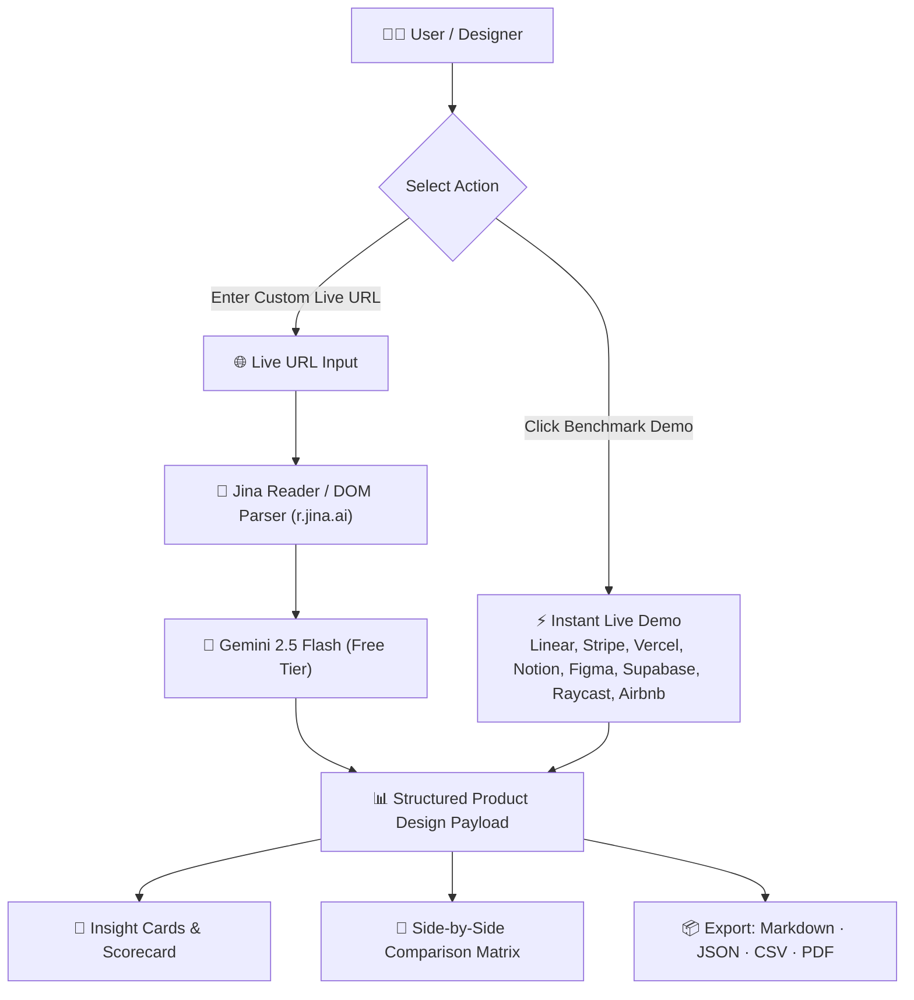

# Competitor Landing Page Summarizer

**[PRIVATE & CONFIDENTIAL]**

---

## Participant Details

**Participant Name:**
Fadly Uzzaki

**Project Title:**
Competitor Landing Page Summarizer

**Project Tagline:**
Turn competitor pages into structured product-design insights

---

## Problem Statement

Product designers frequently analyze competitor landing pages to understand positioning, value proposition, target audience, call-to-action strategy, trust signals, information hierarchy, and UX writing patterns. However, this workflow remains highly manual, repetitive, inconsistent, and difficult to document in a reusable format.

In practice, designers often open several competitor websites, scan each page manually, take fragmented notes, and then spend additional time converting those observations into structured benchmarking documents. This slows down early-stage discovery, reduces comparability between products, and creates unnecessary cognitive load.

The problem is not the lack of available information. The problem is the lack of a simple system that can transform public landing pages into structured, design-relevant insight that is immediately useful for benchmarking and product analysis.

---

## Brief about the Idea

Competitor Landing Page Summarizer is an agentic web application that helps product designers transform competitor landing pages into structured product-design insights.

A user simply pastes a public landing page URL into the webapp (or selects from the 100 pre-loaded live benchmark datasets across 5 software categories). The system retrieves the page content, analyzes it through an ADK/Gemini agent pipeline, and returns a structured summary that includes:

- **Product / Brand, Category & Specs**
- **Core Value Proposition**
- **Likely Target Audience**
- **Main Calls to Action (Primary, Secondary, Discovery)**
- **Information Hierarchy & Cognitive Flow**
- **Trust Signals & Social Proof Density**
- **UX Writing & Tone Observations**
- **Potential Friction Points**
- **Design Opportunities & Winning Angles**
- **Product Designer Takeaway**
- **UX Health & Signal Scorecard (4-point rating)**
- **Side-by-Side Competitor Comparison Matrix (with multi-competitor search)**

The purpose of the solution is to eliminate repetitive benchmarking friction and empower designers to focus on interpretation, strategy, and decision-making.

---

## Meeting the Build Criteria

This solution is intentionally designed to meet the build requirement through the meaningful use of **ADK + MCP + Free-Tier Gemini 2.5 Flash** as core architectural components.

The implementation follows this flexible multi-engine pattern:

```
Mode 1 (100 Benchmarks Directory): Immediate 0s load for 100 curated tech benchmarks across 5 balanced categories (DevTools, Productivity, AI, Fintech, Consumer)
Mode 2 (Free Live AI): Direct Web Extractor (Jina Reader / DOM) → Free Google AI Studio Gemini 2.5 Flash API (100% Zero GCP Billing)
Mode 3 (ADK + MCP): Webapp UI → ADK API Server → ADK Agent → MCP Server Tool (load_web_page) → Structured JSON
```

### How the build criteria are met:

**ADK is used as the reasoning layer**
The backend runs through the official ADK runtime (`adk api_server`) and hosts a dedicated `LlmAgent` named `competitor_summarizer` responsible for product-design analysis. The agent uses `gemini-2.5-flash` with structured JSON schema enforcement.

**MCP is used as the tool integration layer**
A custom MCP server (`backend/mcp_server/server.py`) exposes a webpage-loading tool called `load_web_page`, enabling the ADK agent to retrieve and analyze public webpage content through standardized MCP communication via stdio transport.

**100% Free-Tier & Zero-Barrier Deployment**
The system supports Google AI Studio's free tier Gemini API key with zero Google Cloud credits required, providing full client-side live analysis fallback and instant live demo benchmarking for portfolios and presentations.

---

## List of Features Offered by the Solution

1. **Curated Live Demo Suite (Instant 0s Latency)** — 8 pre-loaded live benchmarks: Linear, Stripe, Vercel, Supabase, Notion, Figma, Raycast, Airbnb.
2. **Analyze Arbitrary Live Webpages with Free Gemini AI** — Fast live webpage parsing via `r.jina.ai` and `gemini-2.5-flash`.
3. **Side-by-Side Competitor Comparison Matrix** — Compare 2 to 4 competitors simultaneously in a synchronized table.
4. **UX Signal Scorecard** — Visual rating metrics (Value Prop Clarity, Conversion Velocity, Trust Density, Friction Resistance).
5. **9-Dimension Product Design Analysis** — Structured JSON output covering all key product design criteria.
6. **Multi-Format Export** — 1-click export to **Markdown** (PRD/Notion format), **JSON**, **CSV spreadsheet**, and **Print / PDF**.
7. **Category Filtering & Search** — Filter insights by Strategy, UX Hierarchy, or Friction/Opportunities, with real-time keyword search.
8. **ADK + MCP Pipeline Support** — Native integration with Python ADK and FastMCP servers.

---

## Process Flow Diagram


```mermaid
flowchart TD
    User["🧑‍💻 User / Designer"] --> Input{"Select Action"}
    Input -->|Click Benchmark Demo| Demos["⚡ Instant Live Demo<br/>Linear, Stripe, Vercel, Notion, Figma, Supabase, Raycast, Airbnb"]
    Input -->|Enter Custom Live URL| Custom["🌐 Live URL Input"]
    Custom --> Scraper["👀 Jina Reader / DOM Parser (r.jina.ai)"]
    Scraper --> Gemini["🤖 Gemini 2.5 Flash (Free Tier)"]
    Gemini --> Results["📊 Structured Product Design Payload"]
    Demos --> Results
    Results --> UI["🎴 Insight Cards & Scorecard"]
    Results --> Matrix["📑 Side-by-Side Comparison Matrix"]
    Results --> Export["📦 Export: Markdown · JSON · CSV · PDF"]
```

---

## Technologies Used in the Solution

### Frontend
| Technology | Version | Purpose |
|---|---|---|
| Vite | ^6.2.0 | High-speed build tool and dev server |
| React | ^19.0.0 | Modern UI component framework |
| TypeScript | ~5.8.2 | Type-safe contract & interface definitions |
| Tailwind CSS | ^4.1.14 | Modern design system styling |
| Motion React | ^12.23.24 | Kinetic animations and transitions |
| Lucide React | ^0.546.0 | Modern icon system |

### AI & Backend
| Technology | Purpose |
|---|---|
| Gemini 2.5 Flash | Free-tier high-speed multimodal reasoning model |
| Google ADK (Agent Development Kit) | Agentic loop orchestration and API server |
| MCP (Model Context Protocol) | Decoupled tool protocol via FastMCP |
| Jina Reader & BeautifulSoup4 | DOM extraction & clean markdown stripping |

---

## Live Deployment & Access

| Target | URL / Details |
|---|---|
| Frontend Web App | Pre-configured for Vercel and Cloud Run |
| Local Dev | `cd frontend && npm run dev` (http://localhost:3000) |
| Free API Key | Google AI Studio (https://aistudio.google.com/app/apikey) |

---

*Engineered by **Fadly Uzzaki**. A system is only as intelligent as the structure behind it. Architecture is survival. © 2025–2026. All Rights Reserved.*
