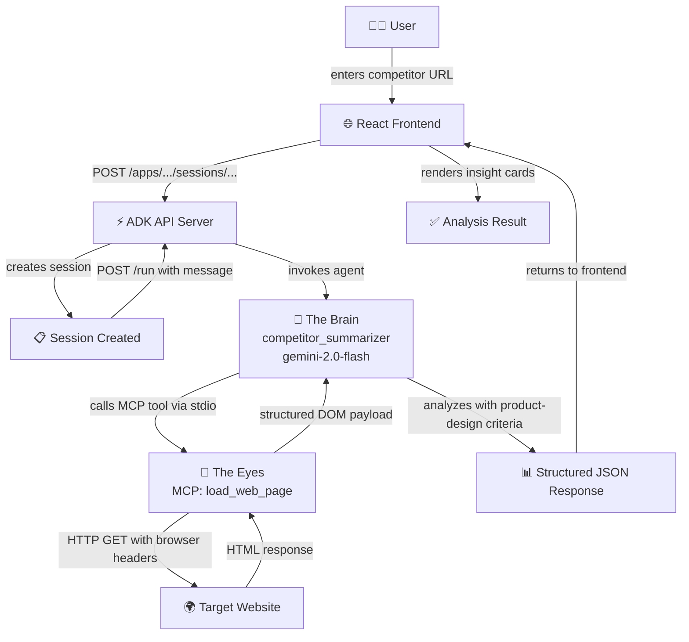

# Competitor Landing Page Summarizer

**A production-grade, agentic AI system for turning competitor pages into structured product-design insights.**

**[PRIVATE & CONFIDENTIAL]**


---

## 🌟 The Product Vision: Signal Over Noise

*“Unstructured competitor intelligence is noise. We don’t just scrape pages; we engineer an agentic pipeline where algorithmic extraction meets structured design intelligence.”*

As a Product Manager, I've watched countless hours burn while teams conduct competitive benchmarking. We open a dozen tabs, manually scan landing pages, take fragmented notes, and then wrestle those observations into a structured format. It’s slow, repetitive, and inconsistent. 

The problem isn't a lack of information—it’s the lack of a system. 

**The Competitor Landing Page Summarizer** solves this by transforming public web pages into structured, artifact-grade benchmarking datasets. We built a system that reduces cognitive load and manual extraction, freeing up the team to focus on what actually matters: strategy, interpretation, and product decisions. 

---

## 🎨 The Design Perspective: Artifact-Grade Benchmarking

Most webpage summarizers are generic or optimized for SEO. From a Product Design standpoint, that’s not actionable. We engineered this system to analyze pages through strict, UX-specific lenses. 

When you feed the engine a URL, it doesn't just "summarize." It structures a JSON payload containing:
- **Core Value Proposition:** What the product promises.
- **Likely Target Audience:** Who it's designed for.
- **Call-to-Action Strategy:** Primary and secondary conversion paths.
- **Trust Signals:** How they build credibility.
- **Information Hierarchy:** The flow of the page.
- **UX Writing Observations:** Tone and microcopy patterns.
- **Friction Points & Design Opportunities:** Where they fail, and where we can win.

The frontend (built with React 19, TailwindCSS, and Framer Motion) renders these insights into an animated, card-based interface with one-click export to JSON or Markdown. It’s designed to be a seamless, polished tool that fits right into a designer's workflow.

---

## 🏗 How I Built This (The Architecture Explained Humanly)

When building an AI agent to read websites, the biggest trap is tangling everything up. If you give the AI direct internet access, it might hallucinate structure or get confused by popups, ads, and CSS files. 

To solve this, **I split the brain from the eyes.** 

Here is the step-by-step of how the system actually works under the hood:

1. **The Brain (Google ADK & Gemini 2.0):** I used Google’s Agent Development Kit (ADK) to create a focused "Agent" named `competitor_summarizer`. Its only job is to reason about design. Powered by Gemini 2.0 Flash via Vertex AI, I gave it a strict instruction: *“Only output data in this exact JSON structure, no matter what.”*
2. **The Eyes (Model Context Protocol - MCP):** Instead of teaching the Brain how to scrape the web, I used MCP to give it a decoupled "tool." I built a separate mini-server with a single function: `load_web_page`. 
3. **The Filter (`requests` + `BeautifulSoup`):** When the `load_web_page` tool runs, it grabs the website's HTML and aggressively strips out all the junk—no scripts, no styling, no hidden tracking pixels. It just extracts pure semantic content like headings, paragraphs, and buttons.
4. **The Handshake:** The Brain asks the Eyes to read a URL. The Eyes return clean, junk-free text. The Brain then analyzes that text using our design criteria and outputs a perfect JSON file.
5. **The Face (React & Vite):** Finally, I built a React 19 frontend that talks to the Brain, grabs that JSON, and animates it into beautiful, readable cards using Framer Motion. 

By separating the scraping from the reasoning, the system becomes highly deterministic. It doesn't guess; it extracts and structures. 

### ⚡ System Signal Flow



---

## 🚀 Deployment Protocol & CI/CD Pipeline

To ensure zero infrastructure maintenance overhead, both the frontend and backend are fully containerized using Docker and deployed to **Google Cloud Run**.

### Local Ignition

**Prerequisites:** Node.js ≥ 18 | Python ≥ 3.11 | Google Cloud SDK | GCP Project with Vertex AI enabled

```bash
# 1. Backend — provision and ignite
cd backend
python -m venv .venv
source .venv/bin/activate
pip install -r requirements.txt

cp .env.example .env
# Configure: GOOGLE_CLOUD_PROJECT, GOOGLE_CLOUD_LOCATION, GOOGLE_GENAI_USE_VERTEXAI

gcloud auth application-default login
adk api_server agents --port 8080

# 2. Frontend — provision and boot
cd frontend
npm install
npm run dev
# → http://localhost:3000
```

### Production Environment (Google Cloud Run)

```bash
# Backend
cd backend
gcloud run deploy competitor-summarizer-backend \
  --source . \
  --region us-central1 \
  --set-env-vars "GOOGLE_CLOUD_PROJECT=your-project-id,GOOGLE_CLOUD_LOCATION=us-central1,GOOGLE_GENAI_USE_VERTEXAI=True" \
  --allow-unauthenticated

# Frontend
cd frontend
gcloud run deploy competitor-summarizer-frontend \
  --source . \
  --region us-central1 \
  --set-env-vars "VITE_ADK_API_BASE_URL=https://your-backend-url.run.app" \
  --allow-unauthenticated
```

---

## ⚙️ Environment Variables

### Backend (`backend/.env`)
| Variable | Description | Example |
|---|---|---|
| `GOOGLE_CLOUD_PROJECT` | GCP project ID | `my-project-123` |
| `GOOGLE_CLOUD_LOCATION` | GCP region | `us-central1` |
| `GOOGLE_GENAI_USE_VERTEXAI` | Enable Vertex AI backend | `True` |

### Frontend (`frontend/.env`)
| Variable | Description | Example |
|---|---|---|
| `VITE_ADK_API_BASE_URL` | Backend Cloud Run URL (empty = localhost) | `https://backend-xyz.run.app` |
| `VITE_ADK_APP_NAME` | Registered ADK agent name | `competitor_summarizer` |

---

## 📄 License

**Private & Proprietary.** All Rights Reserved. See [LICENSE](./LICENSE) for full terms.

---

*Engineered by **Fadly Uzzaki**. A system is only as intelligent as the structure behind it. Architecture is survival. © 2025–2026. All Rights Reserved.*
