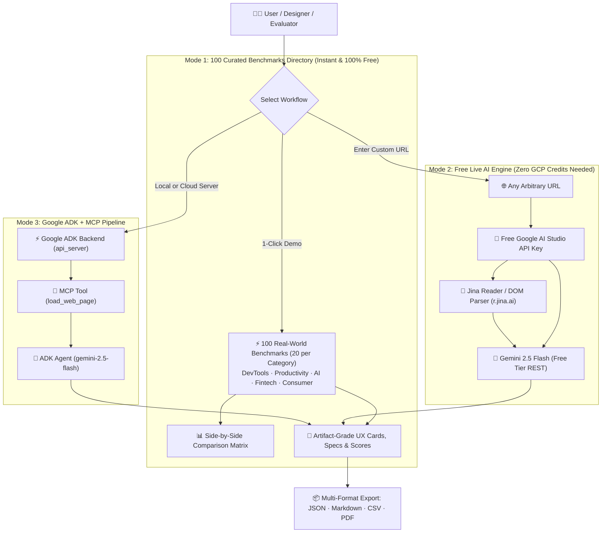

# Competitor Landing Page Summarizer

**A production-grade, agentic AI system for turning competitor pages into structured product-design insights.**

**[PRIVATE & CONFIDENTIAL]**


---

## 🌟 The Product Vision: Signal Over Noise

*“Unstructured competitor intelligence is noise. We don’t just scrape pages; we engineer an agentic pipeline where algorithmic extraction meets structured design intelligence.”*

As a Product Designer & Manager, countles hours burn while teams conduct competitive benchmarking. We open a dozen tabs, manually scan landing pages, take fragmented notes, and then wrestle those observations into a structured format. It’s slow, repetitive, and inconsistent.

The problem isn't a lack of information—it’s the lack of a system.

**The Competitor Landing Page Summarizer** transforms public web pages into structured, artifact-grade benchmarking datasets. It reduces cognitive load and manual extraction, freeing up the team to focus on what actually matters: strategy, interpretation, and product decisions.

---

## 🚀 100% Free-Tier & Production-Ready Architecture

To make the system immediately accessible to anyone with **zero Google Cloud credits and zero cloud billing required**, the platform operates on three flexible execution modes:


```mermaid
flowchart TD
    User["🧑‍💻 User / Designer / Evaluator"] --> Input{"Select Workflow"}
    
    subgraph "Mode 1: 100 Curated Benchmarks Directory (Instant & 100% Free)"
        Input -->|1-Click Demo| DemoData["⚡ 100 Real-World Benchmarks (20 per Category)<br/>DevTools · Productivity · AI · Fintech · Consumer"]
        DemoData --> Matrix["📊 Side-by-Side Comparison Matrix"]
        DemoData --> VisualCard["🎴 Artifact-Grade UX Cards, Specs & Scores"]
    end

    subgraph "Mode 2: Free Live AI Engine (Zero GCP Credits Needed)"
        Input -->|Enter Custom URL| CustomURL["🌐 Any Arbitrary URL"]
        CustomURL --> FreeKey["🔑 Free Google AI Studio API Key"]
        FreeKey --> Scraper["👀 Jina Reader / DOM Parser (r.jina.ai)"]
        FreeKey --> FreeGemini["🤖 Gemini 2.5 Flash (Free Tier REST)"]
        Scraper --> FreeGemini
        FreeGemini --> VisualCard
    end

    subgraph "Mode 3: Google ADK + MCP Pipeline"
        Input -->|Local or Cloud Server| ADKServer["⚡ Google ADK Backend (api_server)"]
        ADKServer --> MCP["👀 MCP Tool (load_web_page)"]
        MCP --> ADKAgent["🤖 ADK Agent (gemini-2.5-flash)"]
        ADKAgent --> VisualCard
    end

    VisualCard --> Export["📦 Multi-Format Export: JSON · Markdown · CSV · PDF"]
```

---

## 🎨 Key Features & Design Intelligence

When you feed the engine a URL (or select from the **100 curated benchmarks**), it structures a comprehensive payload across 9 design dimensions + 4 product specs:
- **Core Value Proposition:** What the product promises and why it matters.
- **Likely Target Audience:** Who the product is designed to convert.
- **Call-to-Action Strategy:** Primary, secondary, and discovery conversion paths.
- **Trust Signals & Social Proof:** Metrics, compliance badges, and enterprise logos.
- **Information Hierarchy:** Flow and cognitive priority of content.
- **UX Writing Observations:** Tone, clarity, and microcopy patterns.
- **Potential Friction Points:** Where users encounter hesitation or ambiguity.
- **Design Opportunities & Winning Angles:** Strategic gaps you can capitalize on.
- **Product Designer Takeaway:** Decoupled editorial executive synthesis with compass badge.
- **Product Specifications Bar:** Primary segment, monetization model, conversion path, and design signature.
- **UX Health Scorecard:** 4-point rating (Value Prop Clarity, Conversion Velocity, Trust Density, Friction Resistance).
- **Side-by-Side Competitor Matrix:** Compare 2 to 4 competitors simultaneously in a synchronized table with search.
- **Multi-Format Export:** 1-click export to **Markdown** (PRD/Notion format), **JSON**, **CSV spreadsheet**, and **Printable PDF**.

---

## ⚡ Quickstart (100% Free & Zero-Setup)

### 1. Instant Live Demo (Frontend Only)
You can run the web app immediately without any backend setup:

```bash
cd frontend
npm install
npm run dev
# → http://localhost:3000
```
*Browse all 100 curated benchmarks categorized into DevTools & Infra (20), Productivity & Design (20), Frontier AI & ML (20), Fintech & B2B SaaS (20), and Consumer & Commerce (20).*

### 2. Free Live AI Analysis for ANY URL
To analyze custom live URLs with Gemini:
1. Open the app (or visit the live deployment at [https://comp-landing-page-summarizer-nine.vercel.app](https://comp-landing-page-summarizer-nine.vercel.app)).
2. Click **"Add API Key"** in the top navigation bar.
3. Get a free API key in 10 seconds from [Google AI Studio](https://aistudio.google.com/app/apikey) (No credit card or GCP billing required).
4. Enter any competitor URL and click **Analyze Page**.

### 3. Optional: Backend ADK + MCP Server
If you wish to run the local Python ADK + MCP pipeline:

```bash
cd backend
python -m venv .venv
source .venv/bin/activate
pip install -r requirements.txt

# Set your free Gemini API key
export GEMINI_API_KEY="your_free_key_from_ai_studio"

# Start the ADK API server
adk api_server agents --port 8080
```

---

## 🚢 Deployment Protocol

### Deploy to Vercel (Frontend Single-Click)
The frontend is pre-configured for Vercel with automatic Vite build detection (`vercel.json`):
```bash
# Via Vercel CLI
vercel
```
*Optional environment variable in Vercel project settings: `VITE_GEMINI_API_KEY` (sets a default free Gemini key for all visitors).*

---

## 📄 License

**Private & Proprietary.** All Rights Reserved. See [LICENSE](./LICENSE) for full terms.

---

*Engineered by **Fadly Uzzaki**. A system is only as intelligent as the structure behind it. Architecture is survival. © 2025–2026. All Rights Reserved.*
