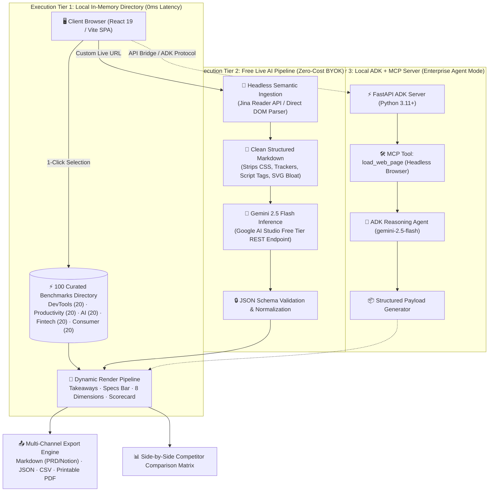

# Competitor Landing Page Summarizer

**A high-velocity, agentic competitive intelligence engine that transforms public web pages into structured product design intelligence.**

[](https://comp-landing-page-summarizer-nine.vercel.app)
[](https://react.dev/)
[-4285F4?style=flat-square&logo=google)](https://aistudio.google.com/)
[](https://github.com/google/agent-development-kit)
[-emerald?style=flat-square)](https://aistudio.google.com/)

---

## 1. System Architecture & Topology

The system is architected as an **isomorphic multi-tier intelligence pipeline** that completely decouples semantic page extraction from structured design reasoning.


```mermaid
flowchart TD
    Client["🖥️ Client Browser (React 19 / Vite SPA)"]
    
    subgraph "Execution Tier 1: Local In-Memory Directory (0ms Latency)"
        Client -->|1-Click Selection| StaticStore[("⚡ 100 Curated Benchmarks Directory<br/>DevTools (20) · Productivity (20) · AI (20) · Fintech (20) · Consumer (20)")]
        StaticStore --> RenderPipeline["🎴 Dynamic Render Pipeline<br/>Takeaways · Specs Bar · 8 Dimensions · Scorecard"]
    end

    subgraph "Execution Tier 2: Free Live AI Pipeline (Zero-Cost BYOK)"
        Client -->|Custom Live URL| DOMParser["👀 Headless Semantic Ingestion<br/>(Jina Reader API / Direct DOM Parser)"]
        DOMParser --> CleanMarkdown["📄 Clean Structured Markdown<br/>(Strips CSS, Trackers, Script Tags, SVG Bloat)"]
        CleanMarkdown --> GeminiREST["🤖 Gemini 2.5 Flash Inference<br/>(Google AI Studio Free Tier REST Endpoint)"]
        GeminiREST --> JSONSchema["🔒 JSON Schema Validation & Normalization"]
        JSONSchema --> RenderPipeline
    end

    subgraph "Execution Tier 3: Local ADK + MCP Server (Enterprise Agent Mode)"
        Client -.->|API Bridge / ADK Protocol| ADKServer["⚡ FastAPI ADK Server (Python 3.11+)"]
        ADKServer --> MCPTool["🛠️ MCP Tool: load_web_page (Headless Browser)"]
        MCPTool --> ADKAgent["🤖 ADK Reasoning Agent (gemini-2.5-flash)"]
        ADKAgent --> StructuredPayload["📦 Structured Payload Generator"]
        StructuredPayload -.-> RenderPipeline
    end

    RenderPipeline --> ExportEngine["📤 Multi-Channel Export Engine<br/>Markdown (PRD/Notion) · JSON · CSV · Printable PDF"]
    RenderPipeline --> MatrixEngine["📊 Side-by-Side Competitor Comparison Matrix"]
```

---

## 2. Core Architectural Invariants

1. **Zero Mandatory Cloud Billing**:
   - The entire platform operates in production without requiring Google Cloud Platform (GCP) billing accounts or Vertex AI credits.
   - Live AI runs directly against Google AI Studio's free-tier rate limits (15 RPM / 1M TPM) using ephemeral client-side API keys.
2. **Deterministic Data Contracts**:
   - The LLM inference engine is constrained to output strict, schema-validated JSON conforming to the `AnalysisResult` TypeScript interface. Hallucinated keys or malformed JSON trigger deterministic fallback normalization.
3. **Client-Side Privacy Boundary (BYOK)**:
   - User-provided Google AI Studio keys are saved strictly in browser `localStorage` and dispatched directly over TLS to Google endpoints. No middleman database or logging proxy touches user API credentials.
4. **Isomorphic Instant Fallback**:
   - 100 comprehensive benchmark datasets (spanning Developer Tools, Productivity & Design, Frontier AI & ML, Fintech & B2B SaaS, and Consumer Tech) are bundled directly into the client bundle, ensuring instant offline responsiveness and zero-latency exploration.

---

## 3. Data Contract Specification

All inference endpoints and pre-compiled benchmark datasets adhere to the following strict type contract:

```typescript
export interface ProductSpecs {
  primary_segment: string;       // e.g., "Engineering & Product Teams"
  monetization_model: string;    // e.g., "Freemium + Per-Seat Subscription"
  conversion_path: string;       // e.g., "Self-Serve Instant Workspace Creation"
  design_signature: string;      // e.g., "Dark Glassmorphism, 100ms Interactions"
}

export interface AnalysisResult {
  url: string;
  product_brand: string;
  tagline?: string;
  category?: string;
  group?: "DevTools" | "Productivity" | "AI" | "Fintech" | "Consumer";
  core_value_proposition: string;
  target_audience: string;
  cta_strategy: string[];
  information_hierarchy: string;
  trust_signals: string[];
  ux_writing_notes: string;
  friction_points: string[];
  design_opportunities: string[];
  designer_summary: string;
  specs?: ProductSpecs;
  analyzed_at?: string;
  is_live_demo?: boolean;
}
```

---

## 4. Benchmark Directory Distribution (100 Products)

The pre-compiled benchmark directory is evenly distributed across 5 industry sectors (exactly 20 per sector):

| Category | Count | Representative Tech Benchmarks | Design Archetype |
|:---|:---:|:---|:---|
| **⚡ DevTools & Cloud Infra** | 20 | Linear, Stripe, Vercel, Supabase, GitHub, Cloudflare, Docker, Postman, Sentry, Resend, Railway, Neon, PlanetScale, Prisma, GitLab, Datadog, HashiCorp, Render, Fly.io, Upstash | Dark Mode, Code Terminals, Monospace, Low Latency |
| **🎨 Productivity & Design** | 20 | Notion, Figma, Raycast, Miro, Loom, Slack, Coda, Arc Browser, Obsidian, Superhuman, ClickUp, Asana, Monday.com, Basecamp, Pitch, Canva, Craft, Bear, Framer, Notion Calendar | Multiplayer Cursors, Modular Blocks, Fluid Motion |
| **🤖 Frontier AI & ML** | 20 | OpenAI, Claude, Perplexity, Cursor, Midjourney, Hugging Face, ElevenLabs, Replicate, Mistral AI, Runway, Cohere, Jasper, Descript, Synthesia, Poe, Character.ai, Phind, DeepL, Suno, Luma AI | Split-Canvas Artifacts, Waveform Visualizers, Prompt Inputs |
| **💳 Fintech & B2B SaaS** | 20 | Ramp, Brex, Mercury, Plaid, Deel, Gusto, Intercom, Webflow, Square, Rippling, Carta, HubSpot, Zendesk, Salesforce, Attio, Retool, Zapier, Make, Segment, Paddle | High Trust Density, Security Badges, Clean Data Grids |
| **🌍 Consumer & Commerce** | 20 | Airbnb, Spotify, Uber, Shopify, Netflix, Duolingo, Substack, DoorDash, Pinterest, Etsy, Robinhood, Instacart, Headspace, Calm, Coursera, Strava, Discord, Twitch, Medium, Kickstarter | Full-Bleed Media, Floating Search Capsules, Gamification |

---

## 5. Engineering Directory Structure

```text
comp-landing-page-summarizer-/
├── frontend/                     # React 19 + TypeScript + Vite Client Application
│   ├── src/
│   │   ├── components/           # Modular UI Components
│   │   │   ├── ApiKeyModal.tsx   # Google AI Studio API Key Manager
│   │   │   ├── ComparisonMatrix.tsx # Multi-Competitor Synchronized Diff Matrix
│   │   │   ├── DesignerTakeaway.tsx # Editorial Executive Callout Block
│   │   │   ├── ScorecardWidget.tsx  # 4-Dimensional UX Health Rating Bar
│   │   │   └── ExportModal.tsx   # Markdown, CSV, JSON, and PDF Export Dialogs
│   │   ├── lib/
│   │   │   ├── liveDemos.ts      # 100 Verified Pre-Compiled Benchmark Datasets
│   │   │   ├── geminiDirect.ts   # Client-Side Gemini 2.5 Flash REST Client
│   │   │   └── webScraper.ts     # Resilient Semantic DOM Ingestion Pipeline
│   │   ├── App.tsx               # Main Application Orchestrator & View Controller
│   │   ├── index.css             # High-End Design System Tokens & Fluid Typography
│   │   └── main.tsx              # React DOM Entrypoint
│   ├── public/                   # Static Production Assets & OG Imagery
│   ├── package.json              # Frontend Dependencies & Scripts
│   └── vite.config.ts            # Vite Bundler Configuration
├── backend/                      # Python Google ADK + MCP Pipeline (Optional Server)
│   ├── api_server.py             # FastAPI REST Gateway
│   ├── agent.py                  # Google ADK Agent Definition
│   ├── prompt.py                 # Structured UX Prompt Engineering Directives
│   └── requirements.txt          # Python Dependencies (google-genai, fastapi, uvicorn)
├── scripts/                      # Automated Benchmark Verification & Generation Tools
│   ├── generate_complete_100_final.py # 100-Benchmark Master Compiler
│   └── ai_list.py, fintech_list.py...  # Category Data Source Modules
├── PRD.md                        # Senior Product Manager Requirements Specification
├── DESIGN.md                     # Principal Design System & UX Token Specification
├── MEDIUM_POST.md                # Engineering Story & Architectural Journey
├── vercel.json                   # Edge Deployment Routing Configuration
└── README.md                     # Technical Architecture & Operations Guide
```

---

## 6. Local Development & Deployment

### Prerequisites
- Node.js `v20.0.0+`
- Python `3.10+` (optional, only for backend ADK server)

### 1. Frontend Development Server
```bash
# Navigate to frontend directory
cd frontend

# Install dependencies
npm install

# Start development server on port 3000
npm run dev
# → http://localhost:3000
```

### 2. Validation & Linting
```bash
# Type check TypeScript codebase
npm --prefix frontend run lint

# Build production bundle
npm --prefix frontend run build
```

### 3. Optional: Backend Google ADK Server
```bash
# Navigate to backend directory
cd backend

# Create virtual environment
python3 -m venv venv
source venv/bin/activate

# Install dependencies
pip install -r requirements.txt

# Run FastAPI ADK server
python api_server.py
# → http://localhost:8000
```

### 4. Production Deployment (Vercel)
The application is pre-configured with `vercel.json` for zero-configuration edge deployments:
```bash
npx --yes vercel --prod --yes
```
- **Live Production URL**: [https://comp-landing-page-summarizer-nine.vercel.app](https://comp-landing-page-summarizer-nine.vercel.app)

---

## 7. Security, Privacy & Compliance

- **Zero Data Ingestion Tracking**: No user-entered URLs, competitor analyses, or custom prompt logs are persisted to remote servers.
- **Client-Side Secret Isolation**: Gemini API keys are scoped to `localStorage` under `gemini_api_key` and injected exclusively into direct HTTPS headers to Google AI Studio.
- **Content Security & Sanitization**: Ingested markdown and DOM text pass through semantic normalization to eliminate XSS injection vectors before rendering into the React component tree.

---

## 8. Author & License

- **Author**: [Fadly Uzzaki](https://fadlyzaki-design.vercel.app/)
- **License**: [Apache-2.0](./LICENSE)
